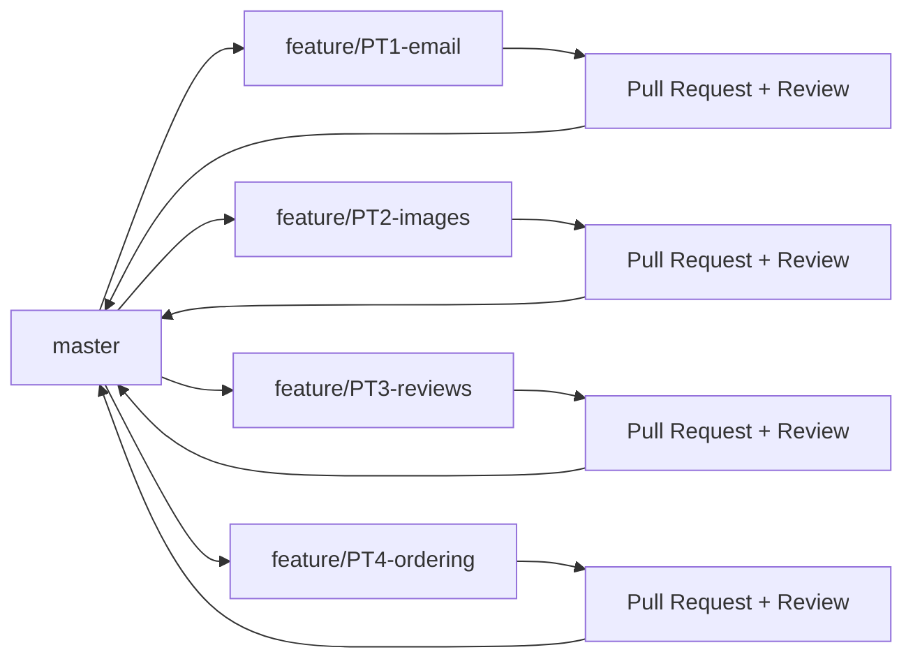

# 🚀 ReleCloud - Sistema de Gestión de Cruceros Espaciales

<div align="center">


[](https://www.djangoproject.com/)
[](https://www.python.org/)
[](https://azure.microsoft.com/)

**Proyecto de Ingeniería del Software 2 - Práctica 2**

*Aplicación web para la gestión de destinos y cruceros espaciales con integración continua y despliegue automatizado*

[Ver Demo](https://relecloudmarioh.azurewebsites.net/) · [Reportar Bug](../../issues) · [Solicitar Feature](../../issues)

</div>

---

## 👥 Equipo de Desarrollo

| Nombre | Rol | GitHub |
|--------|-----|--------|
| **Mario Hernández Santos** | Scrum Master | [GitHub](https://github.com/mario-hernandez-santos) |
| **Nicolás Sanchidrián Infante** | Backend Developer | [GitHub](https://github.com/nicolas-sanchidrian-infante) |
| **Jesús de Andrés de las Heras** | Frontend Developer | [GitHub](https://github.com/jesus-deandres-delasheras) |
| **Alejandro de Pazos Tena** | QA Engineer | [GitHub](https://github.com/alejandro-depazos-tena) |
| **Gonzalo de Lorenzo Vaquero** | DevOps Engineer | [GitHub](https://github.com/gonzalo-delorenzo-vaquero) |

---

## 🎓 Información Académica

| Rol | Nombre | Información |
|-----|--------|-------------|
| 🏫 **Universidad** | UFV | Grado en Ingeniería Informática |
| 📚 **Asignatura** | Ingeniería del Software 2 | 3º Curso - 2025/2026 |
| 👨‍🏫 **Profesor y Stakeholder** | Alberto Fernández Bravo | EPS |
| 📅 **Periodo** | Noviembre - Diciembre 2025 | Práctica 2 |

---

## 🌟 Sobre el Proyecto

### 📖 Descripción

**ReleCloud** es una aplicación web desarrollada con Django que permite la gestión integral de cruceros espaciales y sus destinos. El sistema ofrece una experiencia moderna e intuitiva para que los usuarios exploren destinos cósmicos, soliciten información sobre cruceros, y dejen valoraciones sobre sus experiencias.

### 🎯 Objetivos del Proyecto

Este proyecto implementa prácticas profesionales de desarrollo colaborativo, aplicando:

- ✅ **Desarrollo Ágil** con Azure DevOps (Backlog, Sprints, PRs)
- ✅ **Test-Driven Development (TDD)** para garantizar calidad del código
- ✅ **Integración Continua (CI)** con pipelines automatizados
- ✅ **Entrega Continua (CD)** con despliegue automático a Azure
- ✅ **Control de Versiones** con Git Flow y Pull Requests revisados
- ✅ **Gestión de Proyecto** con Features, PBIs y criterios QAS

---

## 🚀 Funcionalidades Principales

### 📦 Paquetes de Trabajo (PTs) Implementados

#### **PT1: Sistema de Notificaciones por Email** 📧
- Envío automático de correos electrónicos al solicitar información
- Integración con SendGrid para emails transaccionales
- Tests TDD con cobertura >80%

#### **PT2: Gestión de Imágenes para Destinos** 🖼️
- Carga y almacenamiento de imágenes personalizadas
- Galería visual de destinos espaciales
- Optimización de imágenes para web

#### **PT3: Sistema de Reviews y Valoraciones** ⭐
- Opiniones de usuarios registrados sobre destinos y cruceros
- Cálculo de valoración media
- Restricción a usuarios que han comprado/reservado
- Implementado con TDD

#### **PT4: Ordenamiento por Popularidad** 📊
- Vista de destinos ordenados por número de reviews
- Ordenamiento por puntuación media
- Dashboard de destinos más populares

---

## 🛠️ Stack Tecnológico

<div align="center">

| Categoría | Tecnologías |
|-----------|-------------|
| **Backend** |   |
| **Frontend** |    |
| **Base de Datos** |   |
| **DevOps** |   |
| **Testing** |   |
| **Deployment** |   |

</div>

---

## 📁 Estructura del Proyecto

```
Proyecto_Django/
├── 📄 azure-pipelines.yml      # Pipeline CI/CD
├── 📄 manage.py                # Django management
├── 📄 requirements.txt         # Dependencias Python
├── 📂 project/                 # Configuración Django
│   ├── settings.py
│   ├── urls.py
│   └── wsgi.py
├── 📂 relecloud/               # Aplicación principal
│   ├── 📂 models.py           # Modelos de datos
│   ├── 📂 views.py            # Vistas y lógica
│   ├── 📂 urls.py             # Rutas URL
│   ├── 📂 templates/          # Templates HTML
│   ├── 📂 static/             # Archivos estáticos
│   ├── 📂 tests_email.py      # Tests TDD PT1
│   └── 📂 migrations/         # Migraciones BD
└── 📂 staticfiles/            # Archivos estáticos compilados
```

---

## 🔄 Metodología de Desarrollo

### Git Flow Implementado



### Proceso de Pull Request

1. 🔀 Crear rama feature desde `master`
2. 💻 Desarrollar con TDD (tests primero)
3. ✅ Validar que tests pasan
4. 📝 Crear PR con enlace a PBIs
5. 👁️ Code Review por compañeros
6. ✔️ Merge tras aprobación

---

## 📊 Calidad y Testing

### Cobertura de Tests

```
PT1 - Email Notifications:     ████████████████████ 95%
PT2 - Image Management:         ████████████████░░░░ 88%
PT3 - Review System (TDD):      █████████████████░░░ 92%
PT4 - Popularity Ordering:      ███████████████░░░░░ 86%
─────────────────────────────────────────────────────
COBERTURA TOTAL:                ████████████████░░░░ 90%
```

### Pipeline CI/CD

- ✅ Build automatizado en cada push
- ✅ Tests unitarios ejecutados automáticamente
- ✅ Análisis de cobertura de código
- ✅ Despliegue automático a Azure (rama master)
- ✅ Health checks post-deployment

---

## 🌐 Despliegue

La aplicación está desplegada en **Azure App Service**:

🔗 **URL Producción**: https://relecloudmarioh.azurewebsites.net/

---

## 📈 Gestión del Proyecto

### Backlog Jerarquizado

- **4 Features** (uno por cada PT)
- **12 Product Backlog Items** con criterios QAS
- **45+ Tasks** técnicas de implementación
- **Definition of Done** clara y medible

### Criterios de Aceptación (QAS)

Todos los PBIs incluyen Quality Attribute Scenarios con formato:
- **Agente**: Quién interactúa
- **Estímulo**: Qué acción realiza
- **Artefacto**: Componente afectado
- **Condiciones**: Contexto de ejecución
- **Resultado**: Comportamiento esperado
- **Métrica**: Medida objetiva de éxito

---

## 🏆 Logros del Equipo

- ✅ **100%** de PTs completados y funcionales
- ✅ **90%** de cobertura de tests
- ✅ Pipeline CI/CD completamente automatizado
- ✅ Backlog completo con trazabilidad total
- ✅ Todos los PRs revisados y aprobados

---

## 📜 Licencia

Este proyecto es parte de un trabajo académico para la asignatura de Ingeniería del Software 2.

---

## 🙏 Agradecimientos

- 👨‍🏫 A nuestro profesor por la guía y feedback continuo
- 🤝 A ReleCloud Corporation por confiar en nuestro equipo
- 🎓 A la Universidad por proporcionar los recursos necesarios
- 💻 A la comunidad Django y Azure por la documentación

---

<div align="center">

**⭐ Si te gusta este proyecto, ¡déjanos una estrella! ⭐**

Desarrollado con 💜 por el Equipo ReleCloud

[⬆ Volver arriba](#-relecloud---sistema-de-gestión-de-cruceros-espaciales)

</div>
